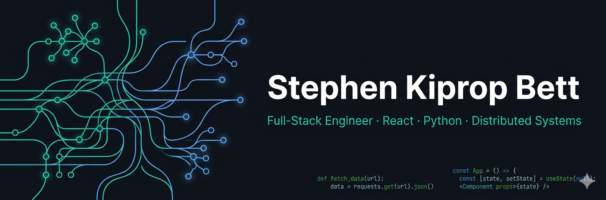

<!-- Banner — replace the URL below once you have your generated image -->

  

<h1 align="center">👋 Hi, I'm Stephen Kiprop Bett</h1>

  <strong>Full-Stack Engineer · Fintech & Gov platforms · Nairobi, Kenya</strong> 
  Open to remote &amp; hybrid opportunities worldwide

  
  
  

---

## 🧑‍💻 About me

Full-Stack Software Engineer with **3+ years** building scalable enterprise systems across fintech, government, and retail. I design clean, modular architectures — from React frontends to Python ML pipelines and event-driven backends using Kafka and RabbitMQ.

My work spans payment integrations (M-Pesa, eCitizen, KRA iTax), distributed systems, and real-time platforms used at a national scale.

- 🏆 Award-winning engineer — Innovation Week (SaccoShareX platform)
- 🌍 Based in Nairobi, Kenya · Open to remote & hybrid roles worldwide
- 📖 Currently deepening: Kafka stream processing · Cloud architecture · MLOps
- 💬 Ask me about: distributed systems, fintech integrations, clean architecture, ML pipelines

---

## 🛠 Tech stack

**Frontend**

**Backend**

**Databases & Messaging**

**DevOps & Tools**

---

## 🚀 Featured projects

### 🤖 Business–Investor Matching Engine
> ML platform that matches businesses with potential investors based on sector similarity, risk profiles, and financial indicators.

- Built end-to-end ML pipeline in **Python (Scikit-learn)** for similarity scoring and clustering
- Integrated **RabbitMQ** for asynchronous, decoupled matching request processing
- Exposed results via **Flask REST API** consumed by a React dashboard
- Full **PyTest** coverage across model evaluation, API, and queue logic

`Python` `Scikit-learn` `RabbitMQ` `Flask` `PostgreSQL` `React`

---

### 🏆 SaccoShareX — Real-Time Fintech Trading Platform
> Award-winning real-time share trading platform for SACCO members. Winner — Innovation Week Competition.

- **SignalR** for real-time notifications and live price updates
- **M-Pesa API** integration for payments, escrow, and disbursements
- **ML.NET** fraud detection and predictive analytics models
- Blockchain-based transaction ledger for full transparency

`React` `.NET Core` `SignalR` `ML.NET` `SQL Server` `M-Pesa API`

---

### 🏪 Astrol POS — Offline-First Enterprise System
> Enterprise POS system engineered to work seamlessly during full network outages.

- **IndexedDB (Dexie.js)** + Service Workers for local transaction processing
- Sync engine to reconcile offline transactions on reconnect
- **Clean Architecture + CQRS (MediatR)** backend
- Multi-tenant with dynamic UI branding per client

`React` `TypeScript` `.NET 8` `Docker` `PWA` `SQL Server`

---

### 🏛 NEMA Licensing Portal — Government Platform
> Nationwide environmental licensing platform supporting multi-level regulatory approval workflows across Kenya.

- Dynamic approval workflow engine for regulatory processes
- **KRA iTax** and **eCitizen/PesaFlow** integrations
- Audit trails, soft-delete logic, and RBAC for compliance

`React` `TypeScript` `.NET 8` `SQL Server` `KRA iTax API`

---

## 📊 GitHub stats

  
  

  

---

## 📫 Let's connect

| Platform | Link |
|---|---|
| 🌐 Portfolio | [portfolio-rosy-xi-52.vercel.app](https://portfolio-rosy-xi-52.vercel.app/) |
| 💼 LinkedIn | [linkedin.com/in/stephen-bett-190166219](https://www.linkedin.com/in/stephen-bett-190166219/) |
| 🐦 X / Twitter | [@stephenbett07](https://twitter.com/stephenbett07) |
| ✉️ Email | bettstephen110@gmail.com |

---

  

